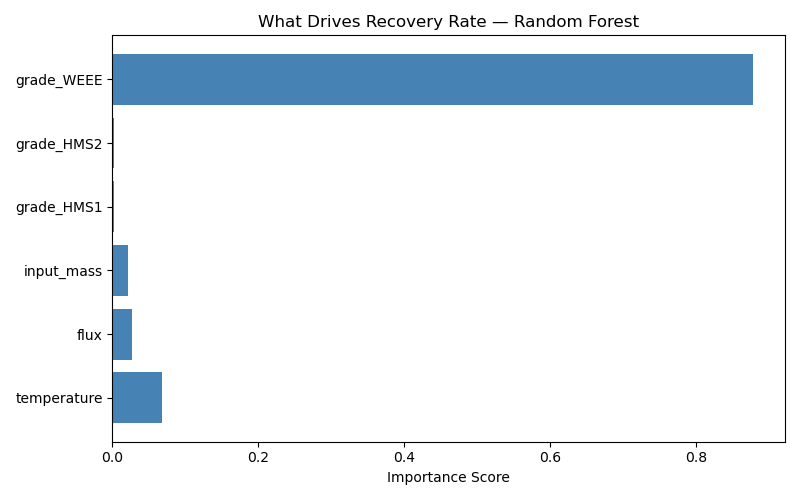

# Metal Recovery Prediction — Copper Recycling Process

A machine learning project predicting copper recovery rates from 
scrap input variables. Built by a Sustainable Process Metallurgy 
engineer combining domain expertise with Python data science.

## The Problem

In secondary copper smelting, recovery rate varies significantly 
based on scrap grade, process temperature, and flux addition. 
Predicting recovery before a heat runs allows operators to optimise 
inputs, reduce material losses, and improve process economics.

## What This Project Does

- Generates and cleans a realistic 100-heat process dataset
- Performs exploratory data analysis with visualisations
- Trains and compares Linear Regression vs Random Forest models
- Identifies which process variables drive recovery rate most

## Results

| Model | MAE | R2 Score |
|-------|-----|----------|
| Linear Regression | 1.08% | 0.924 |
| Random Forest | 1.34% | 0.883 |

Linear Regression achieved 92.4% explanatory power on this dataset.
Scrap grade (particularly WEEE vs HMS grades) was identified as 
the dominant predictor of recovery rate — consistent with 
metallurgical expectations.

## Key Finding

WEEE scrap grade accounts for 87% of model predictive power, 
confirming that feed material quality determines recovery ceiling 
more than process parameters alone.

## Tools Used

- Python 3.13
- Pandas — data cleaning and analysis
- Matplotlib — visualisation
- Scikit-learn — machine learning models

## Author

Muhammad Abdullah  
Engineer — Specialisation in Sustainable Process 
Metallurgy and Metal Recycling  
github.com/muhammadabdullah30